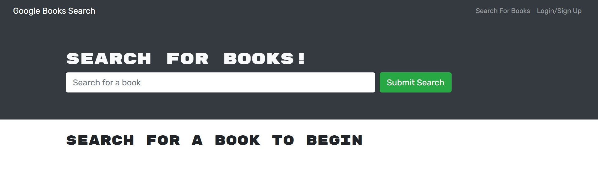
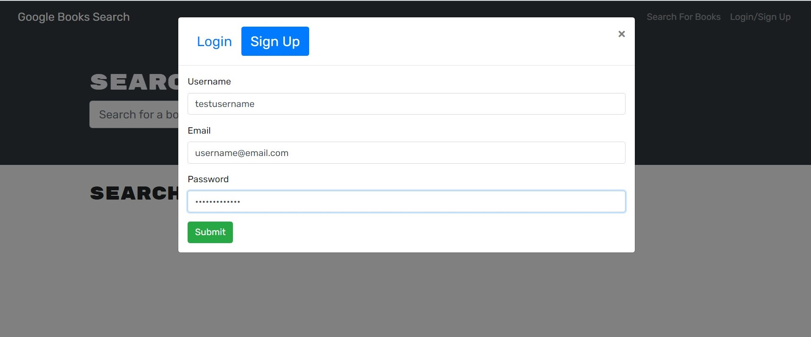
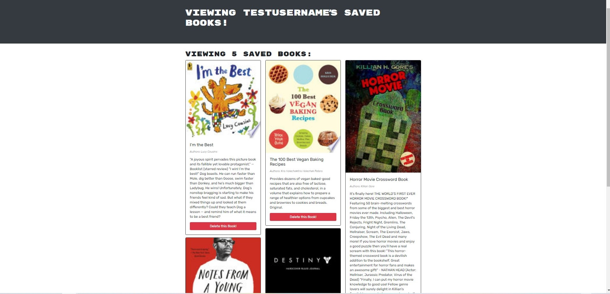

# Book Search Engine

## Description

This a book search engine created using react, nodejs and graphql, where the main goal is to help users to have their book library better organized and easily accessible. In this application, the user is presented with a landing page which permits to search for the book desired. The users have the option to login in their account and save their favorites books.

## Table of Contents

- [Installation](#installation)
- [Usage](#usage)
- [License](#license)
- [Questions](#questions)

## Installation

This application has been created using react and node.js. To run this application please make sure to have node.js installed in your computer.

## Usage

This application has been made to help users to better organize their book library in a simple, organized and easy way.

Below screenshots of some of the features for reference.

- Landing page;

  

- Register a new account;

  

- Searching for books;

  

- Saved books library.

  

## License

This project is covered under MIT license.

[Click here to learn more about this license](https://opensource.org/licenses/MIT)

## Questions

Please feel free to contact me if you have any question or need any further information.

- [GitHub Profile](andybuzzi.github.com)

- [Email Address](andy@gmail.com)
